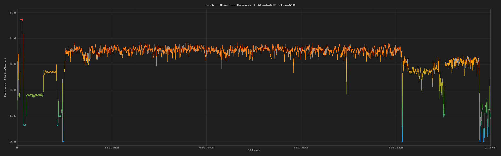
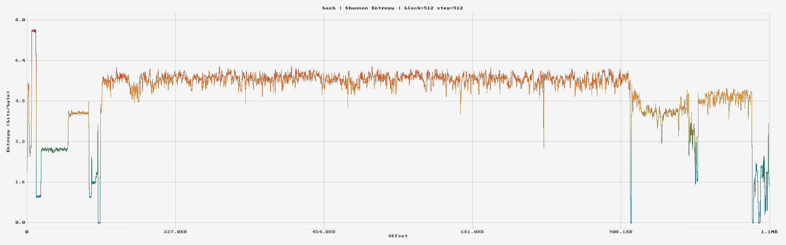

# graphtropy

Fast, lightweight and interactive binary entropy visualizer with an hex viewer and a PNG exporter.



## Features

- Interactive entropy plot with zoom, pan, and click-to-seek
- Hex viewer synced bidirectionally with the plot (click the graph, hex view follows; scroll the hex view, the cursor moves on the graph)
- Byte selection in the hex viewer (click, shift+click, drag) with right-click export to hex, C array, Rust slice, Python bytes, base64, or UTF-8
- Three algorithms: Shannon entropy, chi-squared, byte frequency
- Adjustable block size and step size (standard presets + custom values)
- Dark and Light themes, with support for custom themes via TOML
- Headless PNG export for scripts and reports
- Handles large files gracefully (memory-mapped I/O, automatic downsampling, background computation with loading spinner)

## Install

```
cargo install --path .
```

Or just build it:

```
cargo build --release
```

## Usage

```
graphtropy <file>
```

Opens the GUI. Click anywhere on the entropy plot to jump the hex viewer to that offset. Scroll the hex viewer and the plot cursor follows.

### Keyboard shortcuts

| Key | Action |
|-----|--------|
| `Ctrl+G` | Go to offset (hex or decimal) |
| `Ctrl+S` | Export to PNG |
| `PageUp` / `PageDown` | Scroll hex viewer (click hex view first) |
| `Scroll wheel` | Zoom plot (over plot) or scroll hex (over hex view) |
| `Middle drag` / `Left drag` | Pan plot |
| `Click` | Select byte in hex viewer |
| `Shift+Click` | Extend selection to clicked byte |
| `Drag` | Select byte range in hex viewer |
| `Right-click` | Copy selected bytes in various formats |

### CLI options

```
graphtropy <file> [OPTIONS]

Options:
  -b, --block-size <N>    Block size in bytes [default: 256]
  -s, --step <N>          Step size in bytes [default: block_size]
  -t, --theme <NAME>      Theme name [default: Dark]
  -e, --export <PATH>     Export to PNG and exit (no GUI)
      --width <N>         Export width [default: 1920]
      --height <N>        Export height [default: 600]
      --no-filename       Hide filename from export caption
      --no-algorithm      Hide algorithm from export caption
      --no-sizes          Hide block/step from export caption
      --no-caption        Hide entire caption
```

### Examples

```bash
# basic usage
graphtropy firmware.bin

# smaller block size for more detail
graphtropy firmware.bin -b 64 -s 32

# headless export
graphtropy firmware.bin -e entropy.png

# light theme, custom resolution
graphtropy firmware.bin -e out.png -t Light --width 2560 --height 800

# minimal export (no caption)
graphtropy firmware.bin -e clean.png --no-caption
```

## Themes

Two built-in themes: Dark and Light.

<p float="left">
  
  
</p>

Custom themes live in `~/.config/graphtropy/themes/` as TOML files:

```toml
name = "Thermal"

[[bands]]
threshold = 0.0
color = "#000033"

[[bands]]
threshold = 0.33
color = "#0000FF"

[[bands]]
threshold = 0.66
color = "#FFFF00"

[[bands]]
threshold = 1.0
color = "#FFFFFF"
```

Each band defines a color stop at a normalized threshold (0.0 to 1.0). The gradient interpolates between them.

## Algorithms

| Algorithm | Range | What it shows |
|-----------|-------|---------------|
| Shannon Entropy | 0-8 bits/byte | Randomness per block. High values (6-8) indicate compressed or encrypted data. Low values indicate structured or repetitive content. |
| Chi-Squared | 0-1 | How close the byte distribution is to uniform. 1.0 = perfectly uniform (likely encrypted/compressed). |
| Byte Frequency | 0-1 | Ratio of distinct byte values present in each block. Simple but fast indicator of data diversity. |

## Large files

Files of any size work. For files where the default parameters would produce more than 4096 data points, the step size is automatically increased to keep things responsive. Block size stays small so only a fraction of the file is read into memory.

Entropy is computed in a background thread. The GUI opens immediately with a loading spinner, even for multi-gigabyte files.

## Building

Requires Rust 1.75+ (uses `div_ceil`).

```
cargo build --release
```

Linux dependencies (for the GUI):

```bash
# Debian/Ubuntu
sudo apt install libgtk-3-dev

# Arch
sudo pacman -S gtk3
```

The `--export` flag works without a display server, so headless export on a server is fine.

## License

GPL-3.0
